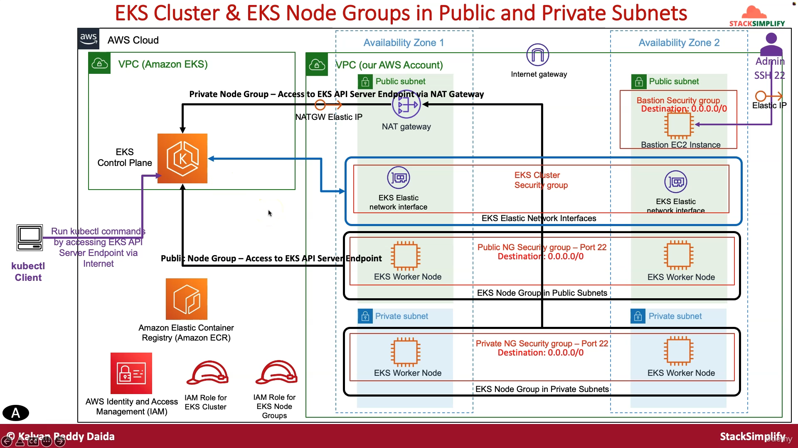
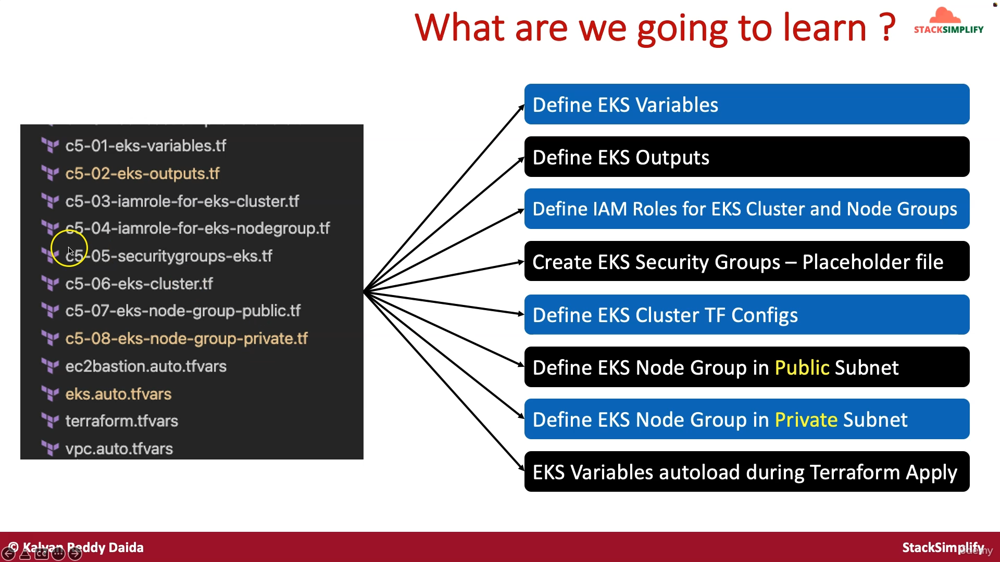
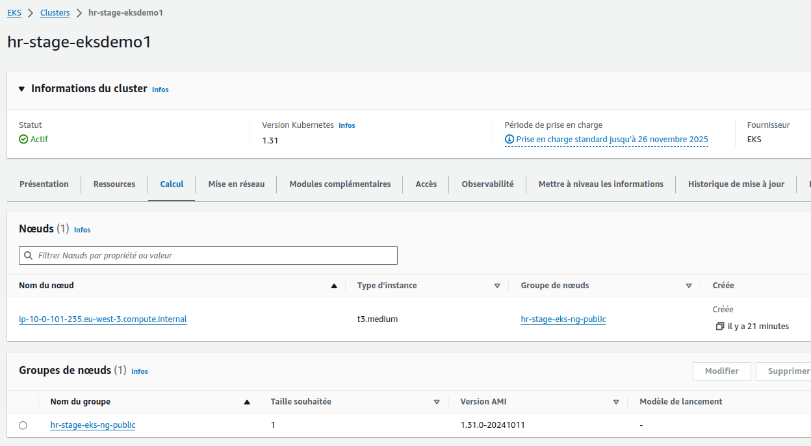

## Step-00: Introduction 
1. Create EKS Cluster
2. Create Public EKS Node Group
3. Create Private EKS Node Group
4. Review the Sample Application Kubernetes Manifests
5. Deploy sample application and verify
6. Clean-Up (Sample Application and EKS Cluster and Node Groups)
## Step-01: Following TF Configs are same from previous section
- **Terraform Configs Folder:** 
- c1-versions.tf
- c2-01-generic-variables.tf
- c2-02-local-values.tf
- c3-01-vpc-variables.tf
- c3-02-vpc-module.tf
- c3-03-vpc-outputs.tf
- c4-01-ec2bastion-variables.tf
- c4-02-ec2bastion-outputs.tf
- c4-03-ec2bastion-securitygroups.tf
- c4-04-ami-datasource.tf
- c4-05-ec2bastion-instance.tf
- c4-06-ec2bastion-elasticip.tf
- c4-07-ec2bastion-provisioners.tf

## Step-02: c5-01-eks-variables.tf
- **Terraform Configs Folder:** 01-ekscluster-terraform-manifests
```t
# EKS Cluster Input Variables
variable "cluster_name" {
  description = "Name of the EKS cluster. Also used as a prefix in names of related resources."
  type        = string
  default     = "eksdemo"
}

variable "cluster_service_ipv4_cidr" {
  description = "service ipv4 cidr for the kubernetes cluster"
  type        = string
  default     = null
}

variable "cluster_version" {
  description = "Kubernetes minor version to use for the EKS cluster (for example 1.21)"
  type = string
  default     = null
}
variable "cluster_endpoint_private_access" {
  description = "Indicates whether or not the Amazon EKS private API server endpoint is enabled."
  type        = bool
  default     = false
}

variable "cluster_endpoint_public_access" {
  description = "Indicates whether or not the Amazon EKS public API server endpoint is enabled. When it's set to `false` ensure to have a proper private access with `cluster_endpoint_private_access = true`."
  type        = bool
  default     = true
}

variable "cluster_endpoint_public_access_cidrs" {
  description = "List of CIDR blocks which can access the Amazon EKS public API server endpoint."
  type        = list(string)
  default     = ["0.0.0.0/0"]
}

# EKS Node Group Variables
## Placeholder space you can create if required

```
## Step-03: c5-03-iamrole-for-eks-cluster.tf
```t
# Create IAM Role
resource "aws_iam_role" "eks_master_role" {
  name = "${local.name}-eks-master-role"

  assume_role_policy = <<POLICY
{
  "Version": "2012-10-17",
  "Statement": [
    {
      "Effect": "Allow",
      "Principal": {
        "Service": "eks.amazonaws.com"
      },
      "Action": "sts:AssumeRole"
    }
  ]
}
POLICY
}

# Associate IAM Policy to IAM Role
resource "aws_iam_role_policy_attachment" "eks-AmazonEKSClusterPolicy" {
  policy_arn = "arn:aws:iam::aws:policy/AmazonEKSClusterPolicy"
  role       = aws_iam_role.eks_master_role.name
}

resource "aws_iam_role_policy_attachment" "eks-AmazonEKSVPCResourceController" {
  policy_arn = "arn:aws:iam::aws:policy/AmazonEKSVPCResourceController"
  role       = aws_iam_role.eks_master_role.name
}

```
## Step-04: c5-04-iamrole-for-eks-nodegroup.tf
```t
# IAM Role for EKS Node Group 
resource "aws_iam_role" "eks_nodegroup_role" {
  name = "${local.name}-eks-nodegroup-role"

  assume_role_policy = jsonencode({
    Statement = [{
      Action = "sts:AssumeRole"
      Effect = "Allow"
      Principal = {
        Service = "ec2.amazonaws.com"
      }
    }]
    Version = "2012-10-17"
  })
}

resource "aws_iam_role_policy_attachment" "eks-AmazonEKSWorkerNodePolicy" {
  policy_arn = "arn:aws:iam::aws:policy/AmazonEKSWorkerNodePolicy"
  role       = aws_iam_role.eks_nodegroup_role.name
}

resource "aws_iam_role_policy_attachment" "eks-AmazonEKS_CNI_Policy" {
  policy_arn = "arn:aws:iam::aws:policy/AmazonEKS_CNI_Policy"
  role       = aws_iam_role.eks_nodegroup_role.name
}

resource "aws_iam_role_policy_attachment" "eks-AmazonEC2ContainerRegistryReadOnly" {
  policy_arn = "arn:aws:iam::aws:policy/AmazonEC2ContainerRegistryReadOnly"
  role       = aws_iam_role.eks_nodegroup_role.name
}

```
## Step-05: c5-05-securitygroups-eks.tf
```t
# Security Group for EKS Node Group - Placeholder file

```
## Step-06: c5-06-eks-cluster.tf
```t
# Create AWS EKS Cluster
resource "aws_eks_cluster" "eks_cluster" {
  name     = "${local.name}-${var.cluster_name}"
  role_arn = aws_iam_role.eks_master_role.arn
  version = var.cluster_version

  vpc_config {
    subnet_ids = module.vpc.public_subnets
    endpoint_private_access = var.cluster_endpoint_private_access
    endpoint_public_access  = var.cluster_endpoint_public_access
    public_access_cidrs     = var.cluster_endpoint_public_access_cidrs    
  }

  kubernetes_network_config {
    service_ipv4_cidr = var.cluster_service_ipv4_cidr
  }
  
  # Enable EKS Cluster Control Plane Logging
  enabled_cluster_log_types = ["api", "audit", "authenticator", "controllerManager", "scheduler"]

  # Ensure that IAM Role permissions are created before and deleted after EKS Cluster handling.
  # Otherwise, EKS will not be able to properly delete EKS managed EC2 infrastructure such as Security Groups.
  depends_on = [
    aws_iam_role_policy_attachment.eks-AmazonEKSClusterPolicy,
    aws_iam_role_policy_attachment.eks-AmazonEKSVPCResourceController,
  ]
}

```
## Step-07: c5-07-eks-node-group-public.tf
```t
# Create AWS EKS Node Group - Public
resource "aws_eks_node_group" "eks_ng_public" {
  cluster_name    = aws_eks_cluster.eks_cluster.name

  node_group_name = "${local.name}-eks-ng-public"
  node_role_arn   = aws_iam_role.eks_nodegroup_role.arn
  subnet_ids      = module.vpc.public_subnets
  #version = var.cluster_version #(Optional: Defaults to EKS Cluster Kubernetes version)    
  
  ami_type = "AL2_x86_64"  
  capacity_type = "ON_DEMAND"
  disk_size = 20
  instance_types = ["t3.medium"]
  
  
  remote_access {
    ec2_ssh_key = "eks-terraform-key"
  }

  scaling_config {
    desired_size = 1
    min_size     = 1    
    max_size     = 2
  }

  # Desired max percentage of unavailable worker nodes during node group update.
  update_config {
    max_unavailable = 1    
    #max_unavailable_percentage = 50    # ANY ONE TO USE
  }

  # Ensure that IAM Role permissions are created before and deleted after EKS Node Group handling.
  # Otherwise, EKS will not be able to properly delete EC2 Instances and Elastic Network Interfaces.
  depends_on = [
    aws_iam_role_policy_attachment.eks-AmazonEKSWorkerNodePolicy,
    aws_iam_role_policy_attachment.eks-AmazonEKS_CNI_Policy,
    aws_iam_role_policy_attachment.eks-AmazonEC2ContainerRegistryReadOnly,
  ] 

  tags = {
    Name = "Public-Node-Group"
  }
}

```
## Step-08: c5-08-eks-node-group-private.tf
```t
# Create AWS EKS Node Group - Private
resource "aws_eks_node_group" "eks_ng_private" {
  cluster_name    = aws_eks_cluster.eks_cluster.name

  node_group_name = "${local.name}-eks-ng-private"
  node_role_arn   = aws_iam_role.eks_nodegroup_role.arn
  subnet_ids      = module.vpc.private_subnets
  #version = var.cluster_version #(Optional: Defaults to EKS Cluster Kubernetes version)    
  
  ami_type = "AL2_x86_64"  
  capacity_type = "ON_DEMAND"
  disk_size = 20
  instance_types = ["t3.medium"]
  
  
  remote_access {
    ec2_ssh_key = "eks-terraform-key"    
  }

  scaling_config {
    desired_size = 1
    min_size     = 1    
    max_size     = 2
  }

  # Desired max percentage of unavailable worker nodes during node group update.
  update_config {
    max_unavailable = 1    
    #max_unavailable_percentage = 50    # ANY ONE TO USE
  }

  # Ensure that IAM Role permissions are created before and deleted after EKS Node Group handling.
  # Otherwise, EKS will not be able to properly delete EC2 Instances and Elastic Network Interfaces.
  depends_on = [
    aws_iam_role_policy_attachment.eks-AmazonEKSWorkerNodePolicy,
    aws_iam_role_policy_attachment.eks-AmazonEKS_CNI_Policy,
    aws_iam_role_policy_attachment.eks-AmazonEC2ContainerRegistryReadOnly,
  ]  
  tags = {
    Name = "Private-Node-Group"
  }
}


```
## Step-09: eks.auto.tfvars
```t
cluster_name = "eksdemo1"
cluster_service_ipv4_cidr = "172.20.0.0/16"
cluster_version = "1.26"
cluster_endpoint_private_access = true
cluster_endpoint_public_access = true
cluster_endpoint_public_access_cidrs = ["0.0.0.0/0"]
```

## Step-10: c5-02-eks-outputs.tf
```t
# EKS Cluster Outputs
output "cluster_id" {
  description = "The name/id of the EKS cluster."
  value       = aws_eks_cluster.eks_cluster.id
}

output "cluster_arn" {
  description = "The Amazon Resource Name (ARN) of the cluster."
  value       = aws_eks_cluster.eks_cluster.arn
}

output "cluster_certificate_authority_data" {
  description = "Nested attribute containing certificate-authority-data for your cluster. This is the base64 encoded certificate data required to communicate with your cluster."
  value       = aws_eks_cluster.eks_cluster.certificate_authority[0].data
}

output "cluster_endpoint" {
  description = "The endpoint for your EKS Kubernetes API."
  value       = aws_eks_cluster.eks_cluster.endpoint
}

output "cluster_version" {
  description = "The Kubernetes server version for the EKS cluster."
  value       = aws_eks_cluster.eks_cluster.version
}

output "cluster_security_group_id" {
  description = "Security group ID attached to the EKS cluster. On 1.14 or later, this is the 'Additional security groups' in the EKS console."
  value       = [aws_eks_cluster.eks_cluster.vpc_config[0].security_group_ids]
}

output "cluster_iam_role_name" {
  description = "IAM role name of the EKS cluster."
  value       = aws_iam_role.eks_master_role.name 
}

output "cluster_iam_role_arn" {
  description = "IAM role ARN of the EKS cluster."
  value       = aws_iam_role.eks_master_role.arn
}

output "cluster_oidc_issuer_url" {
  description = "The URL on the EKS cluster OIDC Issuer"
  value       = aws_eks_cluster.eks_cluster.identity[0].oidc[0].issuer
}

output "cluster_primary_security_group_id" {
  description = "The cluster primary security group ID created by the EKS cluster on 1.14 or later. Referred to as 'Cluster security group' in the EKS console."
  value       = aws_eks_cluster.eks_cluster.vpc_config[0].cluster_security_group_id
}

# EKS Node Group Outputs - Public
output "node_group_public_id" {
  description = "Public Node Group ID"
  value       = aws_eks_node_group.eks_ng_public.id
}

output "node_group_public_arn" {
  description = "Public Node Group ARN"
  value       = aws_eks_node_group.eks_ng_public.arn
}

output "node_group_public_status" {
  description = "Public Node Group status"
  value       = aws_eks_node_group.eks_ng_public.status 
}

output "node_group_public_version" {
  description = "Public Node Group Kubernetes Version"
  value       = aws_eks_node_group.eks_ng_public.version
}

# EKS Node Group Outputs - Private

output "node_group_private_id" {
  description = "Node Group 1 ID"
  value       = aws_eks_node_group.eks_ng_private.id
}

output "node_group_private_arn" {
  description = "Private Node Group ARN"
  value       = aws_eks_node_group.eks_ng_private.arn
}

output "node_group_private_status" {
  description = "Private Node Group status"
  value       = aws_eks_node_group.eks_ng_private.status 
}

output "node_group_private_version" {
  description = "Private Node Group Kubernetes Version"
  value       = aws_eks_node_group.eks_ng_private.version
}
```

## Step-11: Execute Terraform Commands
```t
# Terraform Initialize
terraform init

# Terraform Validate
terraform validate

# Terraform plan
terraform plan

# Terraform Apply
terraform apply -auto-approve

# Verify Outputs on the CLI or using below command
terraform output
```

## Step-12: Verify the following Services using AWS Management Console
1. Go to Services -> Elastic Kubernetes Service -> Clusters
2. Verify the following
   - Overview




   - Workloads
   - Configuration
     - Details
     - Compute
     - Networking
     - Add-Ons
     - Authentication
     - Logging
     - Update history
     - Tags


## Step-13: Install kubectl CLI
- [Install kubectl CLI](https://docs.aws.amazon.com/eks/latest/userguide/install-kubectl.html)

## Step-14: Configure kubeconfig for kubectl
```t
# Configure kubeconfig for kubectl
aws eks update-kubeconfig --region <region-code> --name <cluster_name>
aws eks update-kubeconfig --region eu-west-3 --name hr-stag-eksdemo1

# List Worker Nodes
kubectl get nodes
kubectl get nodes -o wide

# Verify Services
kubectl get svc
```

## Step-15: Connect to EKS Worker Nodes using Bastion Host
```t
# Connect to Bastion EC2 Instance
ssh -i private-key/eks-terraform-key.pem ec2-user@<Bastion-EC2-Instance-Public-IP>
cd /tmp

# Connect to Kubernetes Worker Nodes - Public Node Group
ssh -i private-key/eks-terraform-key.pem ec2-user@<Public-NodeGroup-EC2Instance-PublicIP> 
[or]
ec2-user@<Public-NodeGroup-EC2Instance-PrivateIP>

# Connect to Kubernetes Worker Nodes - Private Node Group from Bastion Host
ssh -i eks-terraform-key.pem ec2-user@<Private-NodeGroup-EC2Instance-PrivateIP>

##### REPEAT BELOW STEPS ON BOTH PUBLIC AND PRIVATE NODE GROUPS ####
# Verify if kubelet and kube-proxy running
ps -ef | grep kube

# Verify kubelet-config.json
cat /etc/kubernetes/kubelet/kubelet-config.json

# Verify kubelet kubeconfig
cat /var/lib/kubelet/kubeconfig

# Verify clusters.cluster.server value(EKS Cluster API Server Endpoint)  DNS resolution which is taken from kubeconfig
nslookup <EKS Cluster API Server Endpoint>
nslookup CF89341F3269FB40F03AAB19E695DBAD.gr7.eu-west-3.eks.amazonaws.com
Very Important Note: Test this on Bastion Host, as EKS worker nodes doesnt have nslookup tool installed. 
[or]
# Verify clusters.cluster.server value(EKS Cluster API Server Endpoint)   with wget 
Try with wget on Node Group EC2 Instances (both public and private)
wget <Kubernetes API Server Endpoint>
wget https://0cbda14fd801e669f05c2444fb16d1b5.gr7.eu-west-3.eks.amazonaws.com

## Sample Output
[ec2-user@ip-10-0-2-205 ~]$ wget https://0cbda14fd801e669f05c2444fb16d1b5.gr7.eu-west-3.eks.amazonaws.com
--2021-12-30 08:40:50--  https://0cbda14fd801e669f05c2444fb16d1b5.gr7.eu-west-3.eks.amazonaws.com/
Resolving 0cbda14fd801e669f05c2444fb16d1b5.gr7.eu-west-3.eks.amazonaws.com (0cbda14fd801e669f05c2444fb16d1b5.gr7.eu-west-3.eks.amazonaws.com)... 54.243.111.82, 34.197.138.103
Connecting to 0cbda14fd801e669f05c2444fb16d1b5.gr7.eu-west-3.eks.amazonaws.com (0cbda14fd801e669f05c2444fb16d1b5.gr7.eu-west-3.eks.amazonaws.com)|54.243.111.82|:443... connected.
ERROR: cannot verify 0cbda14fd801e669f05c2444fb16d1b5.gr7.eu-west-3.eks.amazonaws.com's certificate, issued by ‘/CN=kubernetes’:
  Unable to locally verify the issuer's authority.
To connect to 0cbda14fd801e669f05c2444fb16d1b5.gr7.eu-west-3.eks.amazonaws.com insecurely, use `--no-check-certificate'.
[ec2-user@ip-10-0-2-205 ~]$


# Verify Pod Infra Container for Kubelete
Example: --pod-infra-container-image=602401143452.dkr.ecr.eu-west-3.amazonaws.com/eks/pause:3.1-eksbuild.1
Observation:
1. This Pod Infra container will be downloaded from AWS Elastic Container Registry ECR
2. All the EKS related system pods also will be downloaded from AWS ECR only
```

## Step-16: Verify Namespaces and Resources in Namespaces
```t
# Verify Namespaces
kubectl get namespaces
kubectl get ns 
Observation: 4 namespaces will be listed by default
1. kube-node-lease
2. kube-public
3. default
4. kube-system

# Verify Resources in kube-node-lease namespace
kubectl get all -n kube-node-lease

# Verify Resources in kube-public namespace
kubectl get all -n kube-public

# Verify Resources in default namespace
kubectl get all -n default
Observation: 
1. Kubernetes Service: Cluster IP Service for Kubernetes Endpoint

# Verify Resources in kube-system namespace
kubectl get all -n kube-system
Observation: 
1. Kubernetes Deployment: coredns
2. Kubernetes DaemonSet: aws-node, kube-proxy
3. Kubernetes Service: kube-dns
4. Kubernetes Pods: coredns, aws-node, kube-proxy
```

## Step-17: Verify pods in kube-system namespace
```t
# Verify System pods in kube-system namespace
kubectl get pods # Nothing in default namespace
kubectl get pods -n kube-system
kubectl get pods -n kube-system -o wide

# Verify Daemon Sets in kube-system namespace
kubectl get ds -n kube-system
Observation: The below two daemonsets will be running
1. aws-node
2. kube-proxy

# Describe aws-node Daemon Set
kubectl describe ds aws-node -n kube-system
Observation: 
1. Reference "Image" value it will be the ECR Registry URL 

# Describe kube-proxy Daemon Set
kubectl describe ds kube-proxy -n kube-system
1. Reference "Image" value it will be the ECR Registry URL 

# Describe coredns Deployment
kubectl describe deploy coredns -n kube-system
```

## Step-18: EKS Network Interfaces 
- Discuss about EKS Network Interfaces

## Step-19: EKS Security Groups
- EKS Cluster Security Group
- EKS Node Security Group

## Step-20: Comment EKS Private Node Group TF Configs
- Currently we have 3 EC2 Instances running but ideally we don't need all 3 for our next 3 section (Section-09, 10 and 11), so we will do some cost cutting now. 
- Over the process we will learn how to deprovision resources using Terraform for EKS Cluster
- In all the upcoming few demos we don't need to run both Public and Private Node Groups.
- This is created during Basic EKS Cluster to let you know that we can create EKS Node Groups in our desired subnet (Example: Private Subnets) provided if we have outbound connectivity via NAT Gateway to connect to EKS Cluster Control Plane API Server Endpoint. 
- This adds additional cost for us.
- We will run only Public Node Group with 1 EC2 Instance as Worker Node
- We will comment Private Node Group related code
- **Change-1:** Comment all code in `c5-08-eks-node-group-private.tf`
```t
# Create AWS EKS Node Group - Private
/*
resource "aws_eks_node_group" "eks_ng_private" {
  cluster_name    = aws_eks_cluster.eks_cluster.name

  node_group_name = "${local.name}-eks-ng-private"
  node_role_arn   = aws_iam_role.eks_nodegroup_role.arn
  subnet_ids      = module.vpc.private_subnets
  #version = var.cluster_version #(Optional: Defaults to EKS Cluster Kubernetes version)    
  
  ami_type = "AL2_x86_64"  
  capacity_type = "ON_DEMAND"
  disk_size = 20
  instance_types = ["t3.medium"]
  
  
  remote_access {
    ec2_ssh_key = "eks-terraform-key"    
  }

  scaling_config {
    desired_size = 1
    min_size     = 1    
    max_size     = 2
  }

  # Desired max percentage of unavailable worker nodes during node group update.
  update_config {
    max_unavailable = 1    
    #max_unavailable_percentage = 50    # ANY ONE TO USE
  }

  # Ensure that IAM Role permissions are created before and deleted after EKS Node Group handling.
  # Otherwise, EKS will not be able to properly delete EC2 Instances and Elastic Network Interfaces.
  depends_on = [
    aws_iam_role_policy_attachment.eks-AmazonEKSWorkerNodePolicy,
    aws_iam_role_policy_attachment.eks-AmazonEKS_CNI_Policy,
    aws_iam_role_policy_attachment.eks-AmazonEC2ContainerRegistryReadOnly,
  ]  
  tags = {
    Name = "Private-Node-Group"
  }
}

*/
```
- **Change-2:** Comment private node group related Terraform Outputs in `c5-02-eks-outputs.tf`
```t
# EKS Node Group Outputs - Private
/*
output "node_group_private_id" {
  description = "Node Group 1 ID"
  value       = aws_eks_node_group.eks_ng_private.id
}

output "node_group_private_arn" {
  description = "Private Node Group ARN"
  value       = aws_eks_node_group.eks_ng_private.arn
}

output "node_group_private_status" {
  description = "Private Node Group status"
  value       = aws_eks_node_group.eks_ng_private.status 
}

output "node_group_private_version" {
  description = "Private Node Group Kubernetes Version"
  value       = aws_eks_node_group.eks_ng_private.version
}

*/
```

## Step-21: Execute Terraform Commands & verify
```t
# Terraform Validate
terraform validate

# Terraform Plan
terraform plan

# Terraform Apply
terraform apply -auto-approve

# Verify Kubernetes Worker Nodes
kubectl get nodes -o wide
Observation:
1. Should see only 1 EKS Worker Node running
```

## Step-22: Stop Bastion Host EC2 Instance
- Stop the Bastion VM to save cost
- We will start this VM only when we are in need. 
- It will be provisioned when we create EKS Cluster but we will put it in stopped state unless we need it. 
- This will save one EC2 Instance cost for us. 
- Totally next three sections we will use only EC2 Instance in Public Node Group to run our demos.
```t
# Stop EC2 Instance (Bastion Host)
1. Login to AWS Mgmt Console
2. Go to Services -> EC2 -> Instances -> hr-stag-BastionHost -> Instance State -> Stop
```