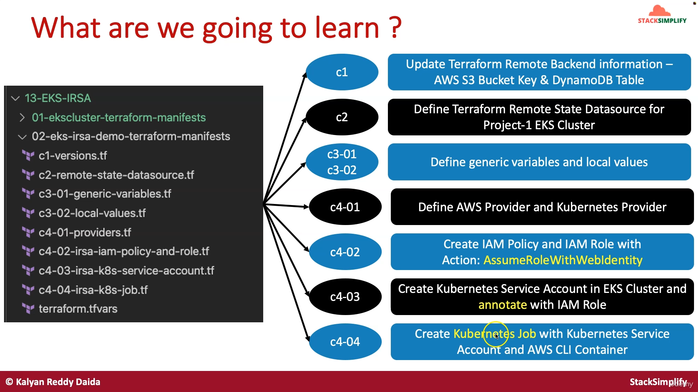

## Step-01: Introduction
1. Verify OIDC Provider in EKS Cluster Terraform Manifests
2. Key Resources for discission in this section
   - [EKS OIDC Provider](https://docs.aws.amazon.com/eks/latest/userguide/iam-roles-for-service-accounts-technical-overview.html)
   - [Kubernetes Service Account](https://kubernetes.io/docs/tasks/configure-pod-container/configure-service-account/)
   - [Kubernetes Jobs](https://kubernetes.io/docs/concepts/workloads/controllers/job/)
   - [EKS IRSA](https://docs.aws.amazon.com/eks/latest/userguide/iam-roles-for-service-accounts.html)
3. [Terraform Element Function](https://www.terraform.io/language/functions/element)
4. [Terraform Split Function](https://www.terraform.io/language/functions/split)
5. [Terraform merge Function](https://www.terraform.io/language/functions/merge)
6. [Terraform JSONEncode Function](https://www.terraform.io/language/functions/jsonencode)

### IRSA et OIDC

#### Pourquoi utiliser IRSA ?

Avant IRSA, toutes les applications qui tournaient sur un même serveur ou nœud (une machine virtuelle dans EKS) partageaient les mêmes permissions AWS. Cela posait un problème de sécurité, car certaines applications pouvaient avoir plus de droits que nécessaire.

Avec IRSA, chaque application (ou pod) peut avoir ses propres permissions AWS, donc chaque application obtient uniquement les droits dont elle a besoin pour faire son travail. C'est beaucoup plus sécurisé et respecte le principe du moindre privilège (donner uniquement les droits nécessaires).


#### IRSA (IAM Roles for Service Accounts)

IRSA est une fonctionnalité qui permet à des applications qui tournent sur Amazon EKS (Elastic Kubernetes Service) d'accéder de manière sécurisée aux ressources AWS (comme S3, DynamoDB, LD, EBS, etc.). Elle permet à chaque application ou service de n'avoir que les permissions nécessaires, et pas plus.

Dans un cluster Kubernetes, les applications tournent dans des pods, qui sont gérés par des comptes de service (service accounts). Avec IRSA, on peut associer un compte de service à un rôle IAM spécifique, qui définit les permissions de l'application. Cela permet d'accéder aux ressources AWS sans donner trop de permissions à d'autres applications sur le même cluster.

#### IAM (Identity and Access Management)

IAM est le système de gestion des permissions dans AWS. Il permet de créer des rôles et des politiques pour définir qui peut accéder à quelles ressources. Dans le cadre d'IRSA, on utilise IAM pour créer des rôles spécifiques à chaque application dans Kubernetes, avec des permissions précises.

#### OIDC (OpenID Connect)

OIDC est un protocole utilisé pour vérifier l'identité des applications. Dans le cas d'IRSA, OIDC permet de lier de manière sécurisée un compte de service Kubernetes à un rôle IAM. AWS utilise ce protocole pour s'assurer que c'est bien l'application autorisée qui demande les permissions.


#### Résumé simplifié :

- IRSA permet à chaque application dans un cluster EKS d'avoir ses propres permissions AWS.
- IAM gère les rôles et permissions dans AWS.
- OIDC est le système qui vérifie que l'application est bien autorisée à utiliser ces permissions.

IRSA permet donc de mieux protéger et contrôler l'accès aux services AWS depuis Kubernetes en donnant les permissions juste nécessaires à chaque application.

#### Qu'est ce qu'on a besoin coté IAM et EKS ?


### Comment ca marche ?


### Qu'est ce qu'on va apprendre

Pour la partie 01-ekscluster-terraform-manifests


Pour la partie 02-eks-irsa-demo-terraform-manifests



## Step-02: Verify Terraform State Storage - EKS Cluster
- **Folder:** `13-EKS-IRSA/01-ekscluster-terraform-manifests`
- Verify Terraform State Storage S3 Bucket in `c1-versions.tf` and AWS Mgmt Console
```t
  # Adding Backend as S3 for Remote State Storage
  backend "s3" {
    bucket = "terraform-on-aws-eks"
    key    = "dev/eks-cluster/terraform.tfstate"
    region = "eu-west-3" 
 
    # For State Locking
    dynamodb_table = "dev-ekscluster"    
  } 
```


## Step-03: Verify Terraform State Locking - EKS Cluster
- **Folder:** `13-EKS-IRSA/01-ekscluster-terraform-manifests`
- Verify Terraform State Locking AWS DynamoDB Table in `c1-versions.tf` and AWS Mgmt Console
```t
  # Adding Backend as S3 for Remote State Storage
  backend "s3" {
    bucket = "terraform-on-aws-eks"
    key    = "dev/eks-cluster/terraform.tfstate"
    region = "eu-west-3" 
 
    # For State Locking
    dynamodb_table = "dev-ekscluster"    
  } 
```

## Step-04: c6-01-iam-oidc-connect-provider-variables.tf
- **Folder:** `13-EKS-IRSA/01-ekscluster-terraform-manifests`
```t
# EKS OIDC ROOT CA Thumbprint - valid until 2037
variable "eks_oidc_root_ca_thumbprint" {
  type        = string
  description = "Thumbprint of Root CA for EKS OIDC, Valid until 2037"
  default     = "9e99a48a9960b14926bb7f3b02e22da2b0ab7280"
}
```

## Step-05: eks.auto.tfvars
- **Folder:** `13-EKS-IRSA/01-ekscluster-terraform-manifests`
- Add variable `eks_oidc_root_ca_thumbprint` in `eks.auto.tfvars`
```t
cluster_name = "eksdemo1"
cluster_service_ipv4_cidr = "172.20.0.0/16"
cluster_version = "1.21"
cluster_endpoint_private_access = false
cluster_endpoint_public_access = true
cluster_endpoint_public_access_cidrs = ["0.0.0.0/0"]
eks_oidc_root_ca_thumbprint = "9e99a48a9960b14926bb7f3b02e22da2b0ab7280"
```

## Step-06: c6-02-iam-oidc-connect-provider.tf
- **Folder:** `13-EKS-IRSA/01-ekscluster-terraform-manifests`
```t
# Datasource: AWS Partition
# Use this data source to lookup information about the current AWS partition in which Terraform is working
data "aws_partition" "current" {}

# Resource: AWS IAM Open ID Connect Provider
resource "aws_iam_openid_connect_provider" "oidc_provider" {
  client_id_list  = ["sts.${data.aws_partition.current.dns_suffix}"]
  thumbprint_list = [var.eks_oidc_root_ca_thumbprint]
  url             = aws_eks_cluster.eks_cluster.identity[0].oidc[0].issuer

  tags = merge(
    {
      Name = "${var.cluster_name}-eks-irsa"
    },
    local.common_tags
  )
}

# Output: AWS IAM Open ID Connect Provider ARN
output "aws_iam_openid_connect_provider_arn" {
  description = "AWS IAM Open ID Connect Provider ARN"
  value = aws_iam_openid_connect_provider.oidc_provider.arn 
}
```

## Step-07: Extract IAM OIDC Provider from ARN
- **Folder:** `13-EKS-IRSA/01-ekscluster-terraform-manifests`
- **File Name:** c6-02-iam-oidc-connect-provider.tf
```t
# Extract OIDC Provider from OIDC Provider ARN
locals {
    aws_iam_oidc_connect_provider_extract_from_arn = element(split("oidc-provider/", "${aws_iam_openid_connect_provider.oidc_provider.arn}"), 1)
}
# Output: AWS IAM Open ID Connect Provider
output "aws_iam_openid_connect_provider_extract_from_arn" {
  description = "AWS IAM Open ID Connect Provider extract from ARN"
   value = local.aws_iam_oidc_connect_provider_extract_from_arn
}
```
- **Sample Output for reference**
```t
# Sample Outputs for Reference
aws_iam_openid_connect_provider_arn = "arn:aws:iam::180789647333:oidc-provider/oidc.eks.eu-west-3.amazonaws.com/id/A9DED4A4FA341C2A5D985A260650F232"
aws_iam_openid_connect_provider_extract_from_arn = "oidc.eks.eu-west-3.amazonaws.com/id/A9DED4A4FA341C2A5D985A260650F232"
```

## Step-08: Create EKS Cluster: Execute Terraform Commands (If not created)
```t
# Change Directory
cd 13-EKS-IRSA/01-ekscluster-terraform-manifests

# Terraform Init
terraform init

# Terraform Validate
terraform validate

# Terraform Plan
terraform plan

# Terraform Apply
terraform apply -auto-approve
...
Apply complete! Resources: 41 added, 0 changed, 0 destroyed.

Outputs:

aws_iam_openid_connect_provider_arn = "arn:aws:iam::851725523446:oidc-provider/oidc.eks.eu-west-3.amazonaws.com/id/E0A35709C01020F10A8D090CED7E6AD8"
aws_iam_openid_connect_provider_extract_from_arn = "oidc.eks.eu-west-3.amazonaws.com/id/E0A35709C01020F10A8D090CED7E6AD8"
azs = tolist([
  "eu-west-3a",
  "eu-west-3b",
  "eu-west-3c",
])
cluster_arn = "arn:aws:eks:eu-west-3:851725523446:cluster/hr-dev-eksdemo1"
cluster_certificate_authority_data = "LS0tLS1CRUdJTiBDRVJUSUZJQ0FURS0tLS0tCk1JSURCVENDQWUyZ0F3SUJBZ0lJVTc1OWp6YWtpYWN3RFFZSktvWklodmNOQVFFTEJRQXdGVEVUTUJFR0ExVUUKQXhNS2EzVmlaWEp1WlhSb...
JRklDQVRFLS0tLS0K"
cluster_endpoint = "https://E0A35709C01020F10A8D090CED7E6AD8.gr7.eu-west-3.eks.amazonaws.com"
cluster_iam_role_arn = "arn:aws:iam::851725523446:role/hr-dev-eks-master-role"
cluster_iam_role_name = "hr-dev-eks-master-role"
cluster_id = "hr-dev-eksdemo1"
cluster_oidc_issuer_url = "https://oidc.eks.eu-west-3.amazonaws.com/id/E0A35709C01020F10A8D090CED7E6AD8"
cluster_primary_security_group_id = "sg-05f73dbfbc0c68f2c"
cluster_version = "1.31"
ec2_bastion_public_instance_ids = "i-01e3b9fbf8f5c71d4"
ec2_bastion_public_ip = "52.47.58.125"
nat_public_ips = tolist([
  "13.36.148.101",
])
node_group_public_arn = "arn:aws:eks:eu-west-3:851725523446:nodegroup/hr-dev-eksdemo1/hr-dev-eks-ng-public/bac95811-ec83-abf5-ba37-cba07ba65d4d"
node_group_public_id = "hr-dev-eksdemo1:hr-dev-eks-ng-public"
node_group_public_status = "ACTIVE"
node_group_public_version = "1.31"
private_subnets = [
  "subnet-08c2507514e37465c",
  "subnet-083fc349173bc81df",
]
public_subnets = [
  "subnet-0262a0258ff93784a",
  "subnet-05479901dbb2785fb",
]
vpc_cidr_block = "10.0.0.0/16"
vpc_id = "vpc-076f0a532d075cfc6"
...
```

On peut voir dans AWS > IAM > Fournisseurs d'identité


L'audience (client_id_list) qui est : sts.amazonaws.com


Et dans le cluster EKS :


## Step-09: Configure Kubeconfig for kubectl
```t
# Configure kubeconfig for kubectl
aws eks --region <region-code> update-kubeconfig --name <cluster_name>
aws eks --region eu-west-3 update-kubeconfig --name hr-dev-eksdemo1

# Verify Kubernetes Worker Nodes using kubectl
kubectl get nodes
kubectl get nodes -o wide

# Stop EC2 Bastion Host
Go to Services -> EC2 -> Instances -> hr-dev-BastionHost -> Instance State -> Stop
```

## Step-10: EKS OpenID Connect Well Known Configuration URL
- We can also call it as `OpenID Connect Discovery URL`
- **Discovery:** Defines how Clients dynamically discover information about OpenID Providers
```t
# Get OpenID Connect provider URL for EKS Cluster
Go to Services -> EKS -> hr-dev-eksdemo1 -> Configuration -> Details -> OpenID Connect provider URL

# EKS OpenID Connect Well Known Configuration URL
<EKS OpenID Connect provider URL>/.well-known/openid-configuration

# Sample
https://oidc.eks.eu-west-3.amazonaws.com/id/EC973221A6C1BC248C79CFD5455EEECC/.well-known/openid-configuration
```
- **Sample Output from EKS OpenID Connect Well Known Configuration URL**
```json
// 20220106104407
// https://oidc.eks.eu-west-3.amazonaws.com/id/EC973221A6C1BC248C79CFD5455EEECC/.well-known/openid-configuration

{
  "issuer": "https://oidc.eks.eu-west-3.amazonaws.com/id/EC973221A6C1BC248C79CFD5455EEECC",
  "jwks_uri": "https://oidc.eks.eu-west-3.amazonaws.com/id/EC973221A6C1BC248C79CFD5455EEECC/keys",
  "authorization_endpoint": "urn:kubernetes:programmatic_authorization",
  "response_types_supported": [
    "id_token"
  ],
  "subject_types_supported": [
    "public"
  ],
  "claims_supported": [
    "sub",
    "iss"
  ],
  "id_token_signing_alg_values_supported": [
    "RS256"
  ]
}
```

## Step-10: Pre-requisite-1: Create folder in S3 Bucket (Optional)
- This step is optional, Terraform can create this folder `dev/ebs-storage` during `terraform apply` but to maintain consistency we create it. 
- Go to Services -> S3 -> 
- **Bucket name:** terraform-on-aws-eks
- **Create Folder**
  - **Folder Name:** dev/eks-irsa-demo
  - Click on **Create Folder**  

## Step-11: Pre-requisite-2: Create DynamoDB Table
- Create Dynamo DB Table for EKS IRSA Demo
  - **Table Name:** dev-eks-irsa-demo
  - **Partition key (Primary Key):** LockID (Type as String)
  - **Table settings:** Use default settings (checked)
  - Click on **Create**

## Step-12: c1-versions.tf
- **Folder:** 02-eks-irsa-demo-terraform-manifests
```t
# Terraform Settings Block
terraform {
  required_version = ">= 1.0.0"
  required_providers {
    aws = {
      source = "hashicorp/aws"
      version = "~> 3.70"
     }
  }
  # Adding Backend as S3 for Remote State Storage
  backend "s3" {
    bucket = "terraform-on-aws-eks"
    key    = "dev/eks-irsa-demo/terraform.tfstate"
    region = "eu-west-3" 

    # For State Locking
    dynamodb_table = "dev-eks-irsa-demo"    
  }     
}
```
## Step-13: c2-remote-state-datasource.tf
- **Folder:** 02-eks-irsa-demo-terraform-manifests
```t
# Terraform Remote State Datasource - Remote Backend AWS S3
data "terraform_remote_state" "eks" {
  backend = "s3"
  config = {
    bucket = "terraform-on-aws-eks"
    key    = "dev/eks-cluster/terraform.tfstate"
    region = var.aws_region
  }
}
```
## Step-14: c3-01-generic-variables.tf
- **Folder:** 02-eks-irsa-demo-terraform-manifests
```t
# Input Variables - Placeholder file
# AWS Region
variable "aws_region" {
  description = "Region in which AWS Resources to be created"
  type = string
  default = "eu-west-3"  
}
# Environment Variable
variable "environment" {
  description = "Environment Variable used as a prefix"
  type = string
  default = "dev"
}
# Business Division
variable "business_divsion" {
  description = "Business Division in the large organization this Infrastructure belongs"
  type = string
  default = "SAP"
}

```
## Step-15: c3-02-local-values.tf
- **Folder:** 02-eks-irsa-demo-terraform-manifests
```t
# Define Local Values in Terraform
locals {
  owners = var.business_divsion
  environment = var.environment
  name = "${var.business_divsion}-${var.environment}"
  common_tags = {
    owners = local.owners
    environment = local.environment
  }
  eks_cluster_name = "${local.name}-${data.terraform_remote_state.eks.outputs.cluster_id}"  
} 
```

## Step-16: c4-01-providers.tf
- **Folder:** 02-eks-irsa-demo-terraform-manifests
```t
# Terraform AWS Provider Block
provider "aws" {
  region = "eu-west-3"
}

data "aws_eks_cluster" "cluster" {
  name = data.terraform_remote_state.eks.outputs.cluster_id
}

data "aws_eks_cluster_auth" "cluster" {
  name = data.terraform_remote_state.eks.outputs.cluster_id
}

# Terraform Kubernetes Provider
provider "kubernetes" {
  host = data.terraform_remote_state.eks.outputs.cluster_endpoint 
  cluster_ca_certificate = base64decode(data.terraform_remote_state.eks.outputs.cluster_certificate_authority_data)
  token = data.aws_eks_cluster_auth.cluster.token
}
```

## Step-17: c4-02-irsa-iam-policy-and-role.tf
- **Folder:** 02-eks-irsa-demo-terraform-manifests
```t
#data.terraform_remote_state.eks.outputs.aws_iam_openid_connect_provider_arn
#data.terraform_remote_state.eks.outputs.aws_iam_openid_connect_provider_extract_from_arn

# Resource: Create IAM Role and associate the EBS IAM Policy to it
resource "aws_iam_role" "irsa_iam_role" {
  name = "${local.name}-irsa-iam-role"

  # Terraform's "jsonencode" function converts a Terraform expression result to valid JSON syntax.
  assume_role_policy = jsonencode({
    Version = "2012-10-17"
    Statement = [
      {
        Action = "sts:AssumeRoleWithWebIdentity"
        Effect = "Allow"
        Sid    = ""
        Principal = {
          Federated = "${data.terraform_remote_state.eks.outputs.aws_iam_openid_connect_provider_arn}"
        }
        Condition = {
          StringEquals = {            
            "${data.terraform_remote_state.eks.outputs.aws_iam_openid_connect_provider_extract_from_arn}:sub": "system:serviceaccount:default:irsa-demo-sa"
          }
        }        

      },
    ]
  })

  tags = {
    tag-key = "${local.name}-irsa-iam-role"
  }
}

# Associate IAM Role and Policy
resource "aws_iam_role_policy_attachment" "irsa_iam_role_policy_attach" {
  policy_arn = "arn:aws:iam::aws:policy/AmazonS3ReadOnlyAccess"
  role       = aws_iam_role.irsa_iam_role.name
}

output "irsa_iam_role_arn" {
  description = "IRSA Demo IAM Role ARN"
  value = aws_iam_role.irsa_iam_role.arn
}
```

## Step-18: c4-03-irsa-k8s-service-account.tf
- **Folder:** 02-eks-irsa-demo-terraform-manifests
```t
# Resource: Kubernetes Service Account
resource "kubernetes_service_account_v1" "irsa_demo_sa" {
  depends_on = [ aws_iam_role_policy_attachment.irsa_iam_role_policy_attach ]
  metadata {
    name = "irsa-demo-sa"
    annotations = {
      "eks.amazonaws.com/role-arn" = aws_iam_role.irsa_iam_role.arn
      }
  }
}
```

## Step-19: c4-04-irsa-k8s-job.tf
- **Folder:** 02-eks-irsa-demo-terraform-manifests
```t
# Resource: Kubernetes Job
resource "kubernetes_job_v1" "irsa_demo" {
  metadata {
    name = "irsa-demo"
  }
  spec {
    template {
      metadata {
        labels = {
          app = "irsa-demo"
        }
      }
      spec {
        service_account_name = kubernetes_service_account_v1.irsa_demo_sa.metadata.0.name 
        container {
          name    = "irsa-demo"
          image   = "amazon/aws-cli:latest"
          args = ["s3", "ls"]
          #args = ["ec2", "describe-instances", "--region", "${var.aws_region}"] # Should fail as we don't have access to EC2 Describe Instances for IAM Role
        }
        restart_policy = "Never"
      }
    }
  }
}
```
## Step-20: terraform.tfvars
- **Folder:** 02-eks-irsa-demo-terraform-manifests
```t
# Generic Variables
aws_region = "eu-west-3"
environment = "dev"
business_divsion = "hr"
```
## Step-21: Execute Terraform Commands
- **Folder:** 02-eks-irsa-demo-terraform-manifests
```t
# Change Directory
cd 13-EKS-IRSA/02-eks-irsa-demo-terraform-manifests

# Terraform Init
terraform init

# Terraform Validate
terraform validate

# Terraform Plan
terraform plan

# Terraform Apply
$ terraform apply -auto-approve
...
Apply complete! Resources: 4 added, 0 changed, 0 destroyed.

Outputs:

irsa_iam_role_arn = "arn:aws:iam::851725523446:role/hr-dev-irsa-iam-role"
```

## Step-22: Verify Resources
```t
# Verify Kubernetes Service Account
$ kubectl get sa
NAME           SECRETS   AGE
default        0         54m
irsa-demo-sa   0         106s

$ kubectl describe sa irsa-demo-sa
Name:                irsa-demo-sa
Namespace:           default
Labels:              <none>
Annotations:         eks.amazonaws.com/role-arn: arn:aws:iam::851725523446:role/hr-dev-irsa-iam-role
Image pull secrets:  <none>
Mountable secrets:   <none>
Tokens:              <none>
Events:              <none>

Observation:
1. We can see that IAM Role ARN is associated in Annotations field of Kubernetes Service Account

# List & Describe Kubernetes Jobs
$ kubectl get job
NAME        STATUS     COMPLETIONS   DURATION   AGE
irsa-demo   Complete   1/1           16s        2m38s

$ kubectl describe job irsa-demo
Name:             irsa-demo
Namespace:        default
Selector:         batch.kubernetes.io/controller-uid=bba9ec60-5559-495c-b0d7-6ca9729870fd
Labels:           app=irsa-demo
                  batch.kubernetes.io/controller-uid=bba9ec60-5559-495c-b0d7-6ca9729870fd
                  batch.kubernetes.io/job-name=irsa-demo
                  controller-uid=bba9ec60-5559-495c-b0d7-6ca9729870fd
                  job-name=irsa-demo
Annotations:      <none>
Parallelism:      1
Completions:      1
Completion Mode:  NonIndexed
Suspend:          false
Backoff Limit:    6
Start Time:       Mon, 21 Oct 2024 20:24:15 +0200
Completed At:     Mon, 21 Oct 2024 20:24:31 +0200
Duration:         16s
Pods Statuses:    0 Active (0 Ready) / 1 Succeeded / 0 Failed
Pod Template:
  Labels:           app=irsa-demo
                    batch.kubernetes.io/controller-uid=bba9ec60-5559-495c-b0d7-6ca9729870fd
                    batch.kubernetes.io/job-name=irsa-demo
                    controller-uid=bba9ec60-5559-495c-b0d7-6ca9729870fd
                    job-name=irsa-demo
  Service Account:  irsa-demo-sa
  Containers:
   irsa-demo:
    Image:      amazon/aws-cli:latest
    Port:       <none>
    Host Port:  <none>
    Args:
      s3
      ls
    Environment:   <none>
    Mounts:        <none>
  Volumes:         <none>
  Node-Selectors:  <none>
  Tolerations:     <none>
Events:
  Type    Reason            Age    From            Message
  ----    ------            ----   ----            -------
  Normal  SuccessfulCreate  2m55s  job-controller  Created pod: irsa-demo-jd86r
  Normal  Completed         2m39s  job-controller  Job completed


Observation:
1. You should see COMPLETIONS 1/1
2. You should see when you describe Pods Statuses:  0 Running / 1 Succeeded / 0 Failed

# Verify Logs (by giving job label app=irsa-demo)
$ kubectl logs -f -l app=irsa-demo
2024-10-21 11:16:42 ingcloud-terraform-state

Observation: 
1. You can see all the S3 buckets from your AWS account listed
```

## Step-23: Option-1: Terraform Taint Command: Re-execute the Job using terraform
- Our core focus here is to learn [terraform taint command](https://www.terraform.io/cli/commands/taint)
```t
# Change Directory
cd 13-EKS-IRSA/02-eks-irsa-demo-terraform-manifests

# List Terraform Resources
terraform state list

# Taint Kubernetes Job
terraform taint kubernetes_job_v1.irsa_demo
Observation: 
1. Terraform taint will ensure the resource will get destroyed and recreated during next terraform apply.

# Terraform Plan
terraform plan
Observation: 
1. We should see a message  "kubernetes_job_v1.irsa_demo is tainted, so must be replaced"

# Terraform Plan
terraform apply -auto-approve
Observation:
1. Resource kubernetes_job_v1.irsa_demo should be destroyed and recreated.

# Verify Kubernetes Job
kubectl get job
kubectl describe job irsa-demo
kubectl logs -f -l app=irsa-demo
Observation:
1. k8s Job should run successfully.
```

## Step-24: Option-2: Terraform apply -replace Command: Re-execute the Job using terraform
- Our core focus here is to learn [terraform apply -replace](https://www.terraform.io/cli/commands/taint) command
- Instead of `terraform taint` we can also use `terraform apply -replace` command
```t
# Change Directory
cd 13-EKS-IRSA/02-eks-irsa-demo-terraform-manifests

# List Terraform Resources
terraform state list

# Verify AGE column of job before running replace
kubectl get job irsa-demo

# Terraform Apply with "-replace" option for Kubernetes Job
terraform apply -replace kubernetes_job_v1.irsa_demo 
Observation: 
1. Terraform apply  with "replace" option will ensure the existing resource will get destroyed and recreated with single command.

# Verify Kubernetes Job
kubectl get job
kubectl describe job irsa-demo
kubectl logs -f -l app=irsa-demo
Observation:
1. k8s Job should run successfully.
```
## Step-25: Option-3: Re-execute the Job using terraform and kubectl
- Delete the k8s Job with `kubectl` and create it with `terraform apply`
```t
# Delete the Job with kubectl
kubectl delete job irsa-demo

# Run terraform plan
terraform plan
Observation:
1. It will show that 1 resource to be created which is irsa-demo job

# Run terraform apply
terraform apply -auto-approve
Observation:
1. We should see that irsa-demo job created succesfully

# Verify Kubernetes Job
kubectl get job
kubectl describe job irsa-demo
kubectl logs -f -l app=irsa-demo
Observation:
1. k8s Job should run successfully.
```

## Step-25: CleanUp - IRSA Demo
```t
# Change Directory
cd 13-EKS-IRSA/02-eks-irsa-demo-terraform-manifests

# Terraform Destroy
terraform destroy -auto-approve

# Delete Terraform Provider Plugins
rm -rf .terraform*
```

## Step-26: CleanUp - EKS Cluster (Optional)
- If you are moving to next section now, don't destroy the EKS Cluster
```t
# Change Directory
cd 13-EKS-IRSA/01-ekscluster-terraform-manifests

# Terraform Destroy
terraform destroy -auto-approve

# Delete Terraform Provider Plugins
rm -rf .terraform*
```


## Refefences
