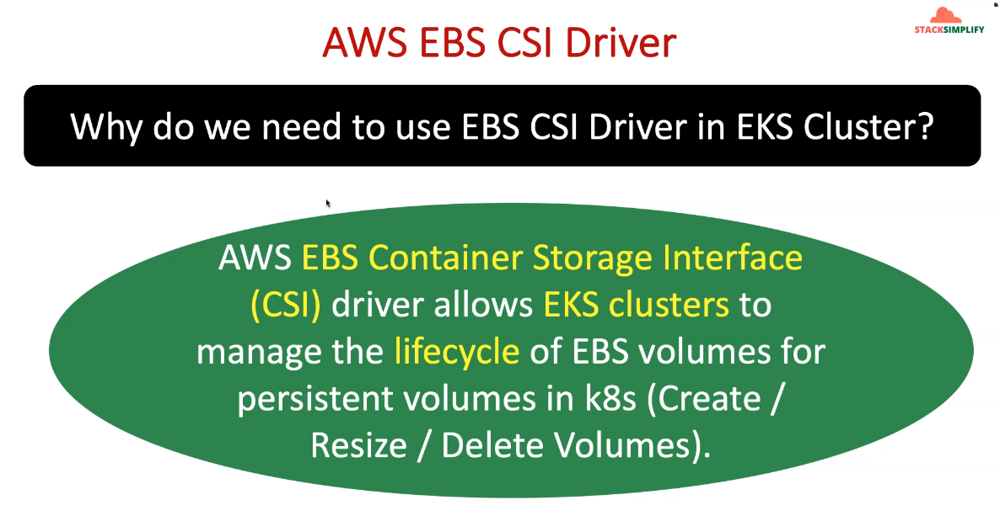
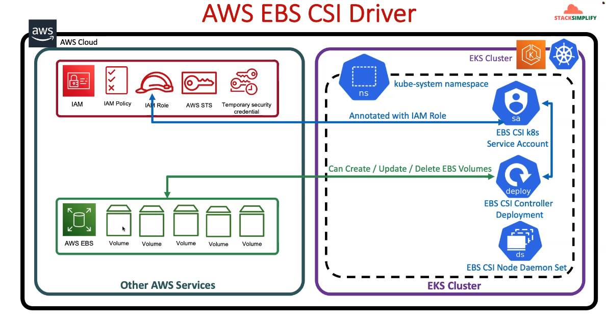
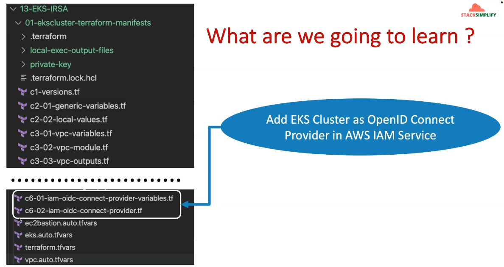
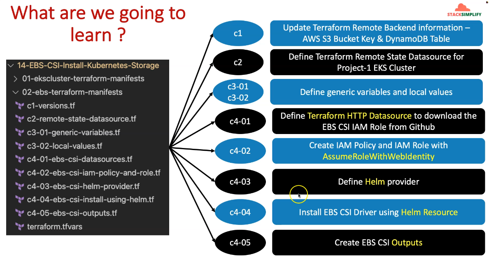

## Step-01: Introduction  
1. Review OIDC Provider added as Identity Provider in AWS IAM Service  (already created as part of Section-13 Demo)
2. We are going to install EKS EBS CSI Driver as a [self-managed Add-On](https://docs.aws.amazon.com/eks/latest/userguide/managing-ebs-csi-self-managed-add-on.html) (and not with EKS Addons - see further) using Terraform
3. Create Terraform configs to install EBS CSI Driver using [HELM Provider](https://registry.terraform.io/providers/hashicorp/helm/latest/docs) and [HELM Release](https://registry.terraform.io/providers/hashicorp/helm/latest/docs/resources/release). 
4. TF Configs for EBS CSI install will be at folder `02-ebs-terraform-manifests`. 
5. Key Resources for discission in this section
   - EBS CSI IAM Policy
   - EBS CSI IAM Role
   - Kubernetes EBS CSI Service Account
   - Kubernetes EBS CSI Controller Deployment
   - Kubernetes EBS CSI Node Daemonset
   - Terraform HELM Provider
   - Terraform HELM Release   
   - Terraform HTTP Datasource

### Slides








## Step-02: Verify Terraform State Storage - EKS Cluster
- **Folder:** `14-EBS-CSI-Install-Kubernetes-Storage/01-ekscluster-terraform-manifests`
- Verify Terraform State Storage S3 Bucket in `c1-versions.tf` and AWS Mgmt Console
```t
  # Adding Backend as S3 for Remote State Storage
  backend "s3" {
    bucket = "terraform-on-aws-eks"
    key    = "dev/eks-cluster/terraform.tfstate"
    region = "eu-west-3" 
 
    # For State Locking
    dynamodb_table = "dev-ekscluster"    
  } 
```


## Step-03: Verify Terraform State Locking - EKS Cluster
- **Folder:** `14-EBS-CSI-Install-Kubernetes-Storage/01-ekscluster-terraform-manifests`
- Verify Terraform State Locking AWS DynamoDB Table in `c1-versions.tf` and AWS Mgmt Console
```t
  # Adding Backend as S3 for Remote State Storage
  backend "s3" {
    bucket = "terraform-on-aws-eks"
    key    = "dev/eks-cluster/terraform.tfstate"
    region = "eu-west-3" 
 
    # For State Locking
    dynamodb_table = "dev-ekscluster"    
  } 
```

## Step-04: Create EKS Cluster: Execute Terraform Commands
- If already EKS Cluster is created, and re-using from previous section ignore the step (terraform apply -auto-approve)
```t
# Change Directory
cd 14-EBS-CSI-Install-Kubernetes-Storage/01-ekscluster-terraform-manifests

# Terraform Init
terraform init

# Terraform Validate
terraform validate

# Terraform Plan
terraform plan

# Terraform Apply (Ignore this if already EKS Cluster created in previous demo)
terraform apply -auto-approve

# List Terraform Resources 
terraform state list
```

We can see the cluster :


The node and the public nodes group :


The OIDC provider in IAM :


## Step-05: Configure Kubeconfig for kubectl
- If already EKS Cluster kubeconfig is configured, ignore this step
```t
# Configure kubeconfig for kubectl
aws eks --region <region-code> update-kubeconfig --name <cluster_name>
aws eks --region eu-west-3 update-kubeconfig --name hr-dev-eksdemo1

# Verify Kubernetes Worker Nodes using kubectl
kubectl get nodes
kubectl get nodes -o wide

# Stop EC2 Bastion Host
Go to Services -> EC2 -> Instances -> hr-dev-BastionHost -> Instance State -> Stop
```

## Step-06: Pre-requisite-1: Create folder in S3 Bucket (Optional)
- This step is optional, Terraform can create this folder `dev/ebs-storage` during `terraform apply` but to maintain consistency we create it. 
- Go to Services -> S3 -> 
- **Bucket name:** terraform-on-aws-eks
- **Create Folder**
  - **Folder Name:** dev/ebs-storage
  - Click on **Create Folder**  

## Step-07: Pre-requisite-2: Create DynamoDB Table
- Create Dynamo DB Table for EBS CSI
  - **Table Name:** dev-ebs-storage
  - **Partition key (Primary Key):** LockID (Type as String)
  - **Table settings:** Use default settings (checked)
  - Click on **Create**


## Step-08: c1-versions.tf
- **Folder:** `14-EBS-CSI-Install-Kubernetes-Storage/02-ebs-terraform-manifests`
```t
# Terraform Settings Block
terraform {
  required_version = ">= 1.0.0"
  required_providers {
    aws = {
      source = "hashicorp/aws"
      version = "~> 3.70"
     }
  }
  # Adding Backend as S3 for Remote State Storage
  backend "s3" {
    bucket = "terraform-on-aws-eks"
    key    = "dev/ebs-storage/terraform.tfstate"
    region = "eu-west-3" 

    # For State Locking
    dynamodb_table = "dev-ebs-storage"    
  }     
}

# Terraform Provider Block
provider "aws" {
  region = var.aws_region
}
```

## Step-09: c2-remote-state-datasource.tf
- **Folder:** `14-EBS-CSI-Install-Kubernetes-Storage/02-ebs-terraform-manifests`
```t
# Terraform Remote State Datasource - Remote Backend AWS S3
data "terraform_remote_state" "eks" {
  backend = "s3"
  config = {
    bucket = "terraform-on-aws-eks"
    key    = "dev/eks-cluster/terraform.tfstate"
    region = var.aws_region
  }
}
```
## Step-10: c3-01-generic-variables.tf
- **Folder:** `14-EBS-CSI-Install-Kubernetes-Storage/02-ebs-terraform-manifests`
```t
# Input Variables - Placeholder file
# AWS Region
variable "aws_region" {
  description = "Region in which AWS Resources to be created"
  type = string
  default = "eu-west-3"  
}
# Environment Variable
variable "environment" {
  description = "Environment Variable used as a prefix"
  type = string
  default = "dev"
}
# Business Division
variable "business_divsion" {
  description = "Business Division in the large organization this Infrastructure belongs"
  type = string
  default = "SAP"
}
```
## Step-11: c3-02-local-values.tf
- **Folder:** `14-EBS-CSI-Install-Kubernetes-Storage/02-ebs-terraform-manifests`
```t
# Define Local Values in Terraform
locals {
  owners = var.business_divsion
  environment = var.environment
  name = "${var.business_divsion}-${var.environment}"
  common_tags = {
    owners = local.owners
    environment = local.environment
  }
  eks_cluster_name = "${data.terraform_remote_state.eks.outputs.cluster_id}"  
} 
```
## Step-12: terraform.tfvars
- **Folder:** `14-EBS-CSI-Install-Kubernetes-Storage/02-ebs-terraform-manifests`
```t
# Generic Variables
aws_region = "eu-west-3"
environment = "dev"
business_divsion = "hr"
```
## Step-13: c4-01-ebs-csi-datasources.tf
- **Folder:** `14-EBS-CSI-Install-Kubernetes-Storage/02-ebs-terraform-manifests`
```t
# Datasource: EBS CSI IAM Policy get from EBS GIT Repo (latest)
data "http" "ebs_csi_iam_policy" {
  url = "https://raw.githubusercontent.com/kubernetes-sigs/aws-ebs-csi-driver/master/docs/example-iam-policy.json"

  # Optional request headers
  request_headers = {
    Accept = "application/json"
  }
}

output "ebs_csi_iam_policy" {
  value = data.http.ebs_csi_iam_policy.body
}
```

## Step-14: c4-02-ebs-csi-iam-policy-and-role.tf
- **Folder:** `14-EBS-CSI-Install-Kubernetes-Storage/02-ebs-terraform-manifests`
```t
#data.terraform_remote_state.eks.outputs.aws_iam_openid_connect_provider_arn
#data.terraform_remote_state.eks.outputs.aws_iam_openid_connect_provider_extract_from_arn

# Resource: Create EBS CSI IAM Policy 
resource "aws_iam_policy" "ebs_csi_iam_policy" {
  name        = "${local.name}-AmazonEKS_EBS_CSI_Driver_Policy"
  path        = "/"
  description = "EBS CSI IAM Policy"
  policy = data.http.ebs_csi_iam_policy.body
}

output "ebs_csi_iam_policy_arn" {
  value = aws_iam_policy.ebs_csi_iam_policy.arn 
}

# Resource: Create IAM Role and associate the EBS IAM Policy to it
resource "aws_iam_role" "ebs_csi_iam_role" {
  name = "${local.name}-ebs-csi-iam-role"

  # Terraform's "jsonencode" function converts a Terraform expression result to valid JSON syntax.
  assume_role_policy = jsonencode({
    Version = "2012-10-17"
    Statement = [
      {
        Action = "sts:AssumeRoleWithWebIdentity"
        Effect = "Allow"
        Sid    = ""
        Principal = {
          Federated = "${data.terraform_remote_state.eks.outputs.aws_iam_openid_connect_provider_arn}"
        }
        Condition = {
          StringEquals = {            
            "${data.terraform_remote_state.eks.outputs.aws_iam_openid_connect_provider_extract_from_arn}:sub": "system:serviceaccount:kube-system:ebs-csi-controller-sa"
          }
        }        

      },
    ]
  })

  tags = {
    tag-key = "${local.name}-ebs-csi-iam-role"
  }
}

# Associate EBS CSI IAM Policy to EBS CSI IAM Role
resource "aws_iam_role_policy_attachment" "ebs_csi_iam_role_policy_attach" {
  policy_arn = aws_iam_policy.ebs_csi_iam_policy.arn 
  role       = aws_iam_role.ebs_csi_iam_role.name
}

output "ebs_csi_iam_role_arn" {
  description = "EBS CSI IAM Role ARN"
  value = aws_iam_role.ebs_csi_iam_role.arn
}
```
## Step-15: c4-03-ebs-csi-helm-provider.tf
- **Folder:** `14-EBS-CSI-Install-Kubernetes-Storage/02-ebs-terraform-manifests`
```t
# Datasource: EKS Cluster Auth 
data "aws_eks_cluster_auth" "cluster" {
  name = data.terraform_remote_state.eks.outputs.cluster_id
}

# HELM Provider
provider "helm" {
  kubernetes {
    host                   = data.terraform_remote_state.eks.outputs.cluster_endpoint
    cluster_ca_certificate = base64decode(data.terraform_remote_state.eks.outputs.cluster_certificate_authority_data)
    token                  = data.aws_eks_cluster_auth.cluster.token
  }
}
```
## Step-16: c4-04-ebs-csi-install-using-helm.tf
- **Folder:** `14-EBS-CSI-Install-Kubernetes-Storage/02-ebs-terraform-manifests`
```t
# Install EBS CSI Driver using HELM
# Resource: Helm Release 
resource "helm_release" "ebs_csi_driver" {
  depends_on = [aws_iam_role.ebs_csi_iam_role ]
  name       = "${local.name}-aws-ebs-csi-driver"

  repository = "https://kubernetes-sigs.github.io/aws-ebs-csi-driver"
  chart      = "aws-ebs-csi-driver"

  namespace = "kube-system"     

  set {
    name = "image.repository"
    value = "602401143452.dkr.ecr.eu-west-3.amazonaws.com/eks/aws-ebs-csi-driver" # Changes based on Region - This is for eu-west-3 Additional Reference: https://docs.aws.amazon.com/eks/latest/userguide/add-ons-images.html
  }       

  set {
    name  = "controller.serviceAccount.create"
    value = "true"
  }

  set {
    name  = "controller.serviceAccount.name"
    value = "ebs-csi-controller-sa"
  }

  set {
    name  = "controller.serviceAccount.annotations.eks\\.amazonaws\\.com/role-arn"
    value = "${aws_iam_role.ebs_csi_iam_role.arn}"
  }
    
}
```
## Step-17: c4-05-ebs-csi-outputs.tf
- **Folder:** `14-EBS-CSI-Install-Kubernetes-Storage/02-ebs-terraform-manifests`
```t
# EBS CSI Helm Release Outputs
output "ebs_csi_helm_metadata" {
  description = "Metadata Block outlining status of the deployed release."
  value = helm_release.ebs_csi_driver.metadata
}
```
## Step-18: Install EBS CSI Driver using HELM: Execute TF Commands
```t
# Change Directory
cd 14-EBS-CSI-Install-Kubernetes-Storage/02-ebs-terraform-manifests

# Terraform Initialize
terraform init

# Terraform Validate
terraform validate

# Terraform Plan
terraform plan

# Terraform Apply
terraform apply -auto-approve

# Verify EBS CSI Outputs
Mainly verify the output related to HELM RELEASE named "ebs_csi_helm_metadata"
```

In the ouput of apply :

```t
...
ebs_csi_helm_metadata = tolist([
  {
    "app_version" = "1.36.0"
    "chart" = "aws-ebs-csi-driver"
    "first_deployed" = 1729588697
    "last_deployed" = 1729588697
    "name" = "devops-dev-aws-ebs-csi-driver"
    "namespace" = "kube-system"
    "notes" = <<-EOT
    To verify that aws-ebs-csi-driver has started, run:
    
        kubectl get pod -n kube-system -l "app.kubernetes.io/name=aws-ebs-csi-driver,app.kubernetes.io/instance=devops-dev-aws-ebs-csi-driver"
...
```


## Step-19: Verify EBS CSI Driver Install on EKS Cluster
```t
# Configure kubeconfig for kubectl (Optional - If already not configured)
$ aws eks --region <region-code> update-kubeconfig --name <cluster_name>
$ aws eks --region eu-west-3 update-kubeconfig --name hr-dev-eksdemo1

# Verify Kubernetes Worker Nodes using kubectl
$ kubectl get nodes
NAME                                        STATUS   ROLES    AGE   VERSION
ip-10-0-102-12.eu-west-3.compute.internal   Ready    <none>   91m   v1.31.0-eks-a737599

kubectl get nodes -o wide

# Verify EBS CSI Pods
$ kubectl -n kube-system get pods
NAME                                 READY   STATUS    RESTARTS   AGE
...
ebs-csi-controller-9c9589d4f-g6x6d   5/5     Running   0          16m
ebs-csi-controller-9c9589d4f-mdc92   5/5     Running   0          16m
ebs-csi-node-jvrkc                   3/3     Running   0          16m
...

Observation: We should see below two pod types from EBS CSI Driver running in kube-system namespace
1. ebs-csi-controller pods
2. ebs-csi-node pods
```

## Step-20: Describe EBS CSI Controller Deployment
```t
# Describe EBS CSI Deployment
$ kubectl -n kube-system get deploy
NAME                 READY   UP-TO-DATE   AVAILABLE   AGE
coredns              2/2     2            2           109m
ebs-csi-controller   2/2     2            2           17m

$ kubectl -n kube-system describe deploy ebs-csi-controller 
Name:                   ebs-csi-controller
Namespace:              kube-system
...
Labels:                 app.kubernetes.io/component=csi-driver
                        ...
                        app.kubernetes.io/managed-by=Helm
                        app.kubernetes.io/name=aws-ebs-csi-driver
                        ...


Observation: ebs-csi-controller Deployment 
1. ebs-csi-controller deployment creates a pod which is a multi-container pod
2. Rarely we get in Kubernetes to explore Multi-Container pod concept, so lets explore it here.
3. Because each "ebs-csi-controller", contains following containers
  - ebs-plugin
  - csi-provisioner
  - csi-attacher
  - csi-resizer
  - liveness-probe
```

## Step-21: Describe EBS CSI Controller Pod
```t
# Describe EBS CSI Controller Pod
$ kubectl -n kube-system get pods 
NAME                                 READY   STATUS    RESTARTS   AGE
...
ebs-csi-controller-9c9589d4f-g6x6d   5/5     Running   0          23m
ebs-csi-controller-9c9589d4f-mdc92   5/5     Running   0          23m
ebs-csi-node-jvrkc                   3/3     Running   0          23m
...

$ kubectl -n kube-system describe pod ebs-csi-controller-9c9589d4f-g6x6d
...
Events:
  Type    Reason     Age   From               Message
  ----    ------     ----  ----               -------
  Normal  Scheduled  25m   default-scheduler  Successfully assigned kube-system/ebs-csi-controller-9c9589d4f-g6x6d to ip-10-0-102-12.eu-west-3.compute.internal
  Normal  Pulling    25m   kubelet            Pulling image "602401143452.dkr.ecr.eu-west-3.amazonaws.com/eks/aws-ebs-csi-driver:v1.36.0"
  Normal  Pulled     25m   kubelet            Successfully pulled image "602401143452.dkr.ecr.eu-west-3.amazonaws.com/eks/aws-ebs-csi-driver:v1.36.0" in 1.607s (1.607s including waiting). Image size: 30580623 bytes.
  Normal  Created    25m   kubelet            Created container ebs-plugin
  Normal  Started    25m   kubelet            Started container ebs-plugin
  Normal  Pulling    25m   kubelet            Pulling image "public.ecr.aws/eks-distro/kubernetes-csi/external-provisioner:v5.1.0-eks-1-31-5"
  Normal  Pulled     25m   kubelet            Successfully pulled image "public.ecr.aws/eks-distro/kubernetes-csi/external-provisioner:v5.1.0-eks-1-31-5" in 2.868s (2.869s including waiting). Image size: 16944930 bytes.
  Normal  Created    25m   kubelet            Created container csi-provisioner
  Normal  Started    25m   kubelet            Started container csi-provisioner
  Normal  Pulling    25m   kubelet            Pulling image "public.ecr.aws/eks-distro/kubernetes-csi/external-attacher:v4.7.0-eks-1-31-5"
  Normal  Pulled     25m   kubelet            Successfully pulled image "public.ecr.aws/eks-distro/kubernetes-csi/external-attacher:v4.7.0-eks-1-31-5" in 2.509s (2.509s including waiting). Image size: 16415167 bytes.
  Normal  Created    25m   kubelet            Created container csi-attacher
  Normal  Started    25m   kubelet            Started container csi-attacher
  Normal  Pulling    25m   kubelet            Pulling image "public.ecr.aws/eks-distro/kubernetes-csi/external-resizer:v1.12.0-eks-1-31-5"
  Normal  Pulled     25m   kubelet            Successfully pulled image "public.ecr.aws/eks-distro/kubernetes-csi/external-resizer:v1.12.0-eks-1-31-5" in 2.59s (2.59s including waiting). Image size: 16317471 bytes.
  Normal  Created    25m   kubelet            Created container csi-resizer
  Normal  Started    25m   kubelet            Started container csi-resizer
  Normal  Pulled     25m   kubelet            Container image "public.ecr.aws/eks-distro/kubernetes-csi/livenessprobe:v2.14.0-eks-1-31-5" already present on machine
  Normal  Created    25m   kubelet            Created container liveness-probe
  Normal  Started    25m   kubelet            Started container liveness-probe


Observations:
1. In the Pod Events, you can multiple containers will be pulled and started in a k8s Pod
```

## Step-22: Verify Container Logs in EBS CSI Controller Pod
```t
# Verify EBS CSI Controller Pod logs
kubectl -n kube-system get pods
kubectl -n kube-system logs -f ebs-csi-controller-56dfd4fccc-7fgbr

# Error we got when checking EBS CSI Controller pod logs because of multi-containers
$ kubectl -n kube-system logs -f ebs-csi-controller-56dfd4fccc-7fgbr
error: a container name must be specified for pod ebs-csi-controller-56dfd4fccc-7fgbr, choose one of: [ebs-plugin csi-provisioner csi-attacher csi-resizer liveness-probe]
$ 

# Verify logs of liveness-probe container in EBS CSI Controller Pod
kubectl -n <NAMESPACE> logs -f <POD-NAME> <CONTAINER-NAME>
kubectl -n kube-system logs -f ebs-csi-controller-56dfd4fccc-7fgbr liveness-probe 

# Verify logs of ebs-plugin container in EBS CSI Controller Pod
kubectl -n <NAMESPACE> logs -f <POD-NAME> <CONTAINER-NAME>
kubectl -n kube-system logs -f ebs-csi-controller-56dfd4fccc-7fgbr ebs-plugin 

# Verify logs of csi-provisioner container in EBS CSI Controller Pod
kubectl -n <NAMESPACE> logs -f <POD-NAME> <CONTAINER-NAME>
kubectl -n kube-system logs -f ebs-csi-controller-56dfd4fccc-7fgbr csi-provisioner 

# Verify logs of csi-attacher container in EBS CSI Controller Pod
kubectl -n <NAMESPACE> logs -f <POD-NAME> <CONTAINER-NAME>
kubectl -n kube-system logs -f ebs-csi-controller-56dfd4fccc-7fgbr csi-attacher 

# Verify logs of csi-resizer container in EBS CSI Controller Pod
kubectl -n <NAMESPACE> logs -f <POD-NAME> <CONTAINER-NAME>
kubectl -n kube-system logs -f ebs-csi-controller-56dfd4fccc-7fgbr csi-resizer 
```

## Step-23: Verify EBS CSI Node Daemonset and Pods
```t
# Verify EBS CSI Node Daemonset
kubectl -n kube-system get daemonset
kubectl -n kube-system get ds
kubectl -n kube-system get pods 
Observation: 
1. We should know that, daemonset means it creates one pod per worker node in a worker node group
2. In our case, we have only 1 node in Worker Node group, it created only 1 pod named "ebs-csi-node-qp426"

# Descrine EBS CSI Node Daemonset (It also a multi-container pod)
kubectl -n kube-system describe ds ebs-csi-node
Observation:
1. We should the following containers listed in this daemonset
 - ebs-plugin 
 - node-driver-registrar 
 - liveness-probe

# Verify EBS CSI Node pods
kubectl -n kube-system get pods 
kubectl -n kube-system describe pod ebs-csi-node-qp426  
Observation:
1. Verify pod events, we can see multiple containers pulled and started in EBS CSI Node pod
```

## Step-24: Verify EBS CSI Node Pod Container Logs
```t
# Verify EBS CSI Node Pod logs
kubectl -n kube-system logs -f ebs-csi-node-qp426

# Error we got when checking EBS CSI Node pod logs because of multiple containers (need to precise the container)
$ kubectl -n kube-system logs -f ebs-csi-node-qp426
error: a container name must be specified for pod ebs-csi-node-qp426, choose one of: [ebs-plugin node-driver-registrar liveness-probe]

# Verify logs of liveness-probe container in EBS CSI Node Pod
kubectl -n <NAMESPACE> logs -f <POD-NAME> <CONTAINER-NAME>
kubectl -n kube-system logs -f ebs-csi-node-qp426 liveness-probe

# Verify logs of ebs-plugin container in EBS CSI Node Pod
kubectl -n <NAMESPACE> logs -f <POD-NAME> <CONTAINER-NAME>
kubectl -n kube-system logs -f ebs-csi-node-qp426 ebs-plugin

# Verify logs of node-driver-registrar container in EBS CSI Node Pod
kubectl -n <NAMESPACE> logs -f <POD-NAME> <CONTAINER-NAME>
kubectl -n kube-system logs -f ebs-csi-node-qp426 node-driver-registrar
```

## Step-25: Verify EBS CSI Kubernetes Service Accounts
```t
# List EBS CSI  Kubernetes Service Accounts
$ kubectl -n kube-system get sa 
NAME                                          SECRETS   AGE
...
ebs-csi-controller-sa                         0         4m31s
ebs-csi-node-sa                               0         4m31s
...

Observation:
1. We should find two service accounts related to EBS CSI
  - ebs-csi-controller-sa
  - ebs-csi-node-sa

# Describe EBS CSI Controller Service Account
$ kubectl -n kube-system describe sa ebs-csi-controller-sa
Name:                ebs-csi-controller-sa
...
Annotations:         eks.amazonaws.com/role-arn: arn:aws:iam::851725523446:role/hr-dev-ebs-csi-iam-role
...

Observation:
1. Verify the "Annotations" field and you should find our IAM Role created for EBS CSI is associated with EKS Cluster EBS Service Account.
Annotations:         eks.amazonaws.com/role-arn: arn:aws:iam::180789647333:role/hr-dev-ebs-csi-iam-role
2. Also review the labels
Labels:              app.kubernetes.io/component=csi-driver
                     app.kubernetes.io/instance=hr-dev-aws-ebs-csi-driver
                     app.kubernetes.io/managed-by=Helm
                     app.kubernetes.io/name=aws-ebs-csi-driver
                     app.kubernetes.io/version=1.5.0
                     helm.sh/chart=aws-ebs-csi-driver-2.6.2


# Describe EBS CSI Node Service Account
kubectl -n kube-system describe sa ebs-csi-node-sa
Observation: 
1. Observe the labels
Labels:              app.kubernetes.io/component=csi-driver
                     app.kubernetes.io/instance=hr-dev-aws-ebs-csi-driver
                     app.kubernetes.io/managed-by=Helm
                     app.kubernetes.io/name=aws-ebs-csi-driver
                     app.kubernetes.io/version=1.5.0
                     helm.sh/chart=aws-ebs-csi-driver-2.6.2
```

## References
- [AWS IAM OIDC Connect Provider - Step-3](https://docs.aws.amazon.com/eks/latest/userguide/getting-started-console.html)
- [AWS EBS CSI Driver](https://docs.aws.amazon.com/eks/latest/userguide/ebs-csi.html)
- [AWS Caller Identity Datasource](https://registry.terraform.io/providers/hashicorp/aws/latest/docs/data-sources/caller_identity)
- [HTTP Datasource](https://registry.terraform.io/providers/hashicorp/http/latest/docs/data-sources/http)
- [AWS IAM Role](https://registry.terraform.io/providers/hashicorp/aws/latest/docs/resources/iam_role)
- [AWS IAM Policy](https://registry.terraform.io/providers/hashicorp/aws/latest/docs/resources/iam_policy)
- [AWS EBS CSI Docker Images across Regions](https://docs.aws.amazon.com/eks/latest/userguide/add-ons-images.html)
- [List All Container Images Running in a Cluster](https://kubernetes.io/docs/tasks/access-application-cluster/list-all-running-container-images/)


